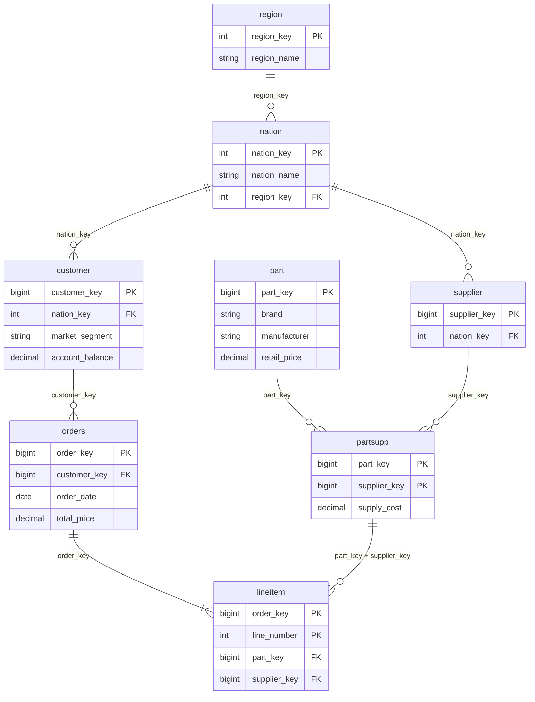

# TPC-H → Lakehouse · Marketing

Group Assignment 1. We migrate the TPC-H wholesale-supplier data (`samples.tpch`) into a
bronze / silver / gold Lakehouse on Databricks and answer the **Marketing** team's questions about
customer acquisition and retention.

- 📊 **Presentation:** `<PASTE LINK>`
- 📈 **Dashboard:** `<PASTE LINK or screenshot in docs/>`
- 👥 **Team:** see [Team & responsibilities](#team--responsibilities)

---

## Architecture

```
samples.tpch ──► bronze (as is) ──► silver (3NF + DQ) ──► gold (marketing marts)
                                         │
                                         └──► ops.quarantine_<table>   (rows that failed rules)
                         validation_results · kpi_snapshots  ◄── 04_validation / 06_monitoring
```

| schema | content |
|---|---|
| `<catalog>.<env>_tpch_mkt_bronze` | 8 tables, exact copy + `_source_table`, `_ingested_at`, `_batch_id` |
| `<catalog>.<env>_tpch_mkt_silver` | 8 tables in 3NF, readable names, PK/FK, NOT NULL + CHECK constraints |
| `<catalog>.<env>_tpch_mkt_gold` | `customer_activity`, `segment_summary`, `segment_kpi_monthly`, `cohort_retention_3m`, `activity_retention_3m` |
| `<catalog>.<env>_tpch_mkt_ops` | `quarantine_*`, `validation_results`, `kpi_snapshots` |

### Portability
* No hard-coded workspace names: `catalog`, `env`, `source` are widgets / job parameters
  (defaults `workspace`, `dev`, `samples.tpch`). Moving to another workspace = change parameters.
* We assume access to **pre-production data only**, so `env` is part of every schema name and
  nothing writes outside `<catalog>.<env>_tpch_mkt_*`.
* All names and rule values live in one place: [`src/tpch_marketing/config.py`](src/tpch_marketing/config.py).
* Requires **Unity Catalog** (PK/FK constraints) — Databricks Free Edition works.

## Repository layout

```
notebooks/
  00_config.py              parameters, schema names (included via %run)
  01_bronze.py              source -> bronze, row-count reconciliation
  02_silver.py              bronze -> silver: types, names, keys, DQ rules, quarantine
  03_gold.py                silver -> gold marketing tables
  04_validation.py          validation rules across all layers (fails the job on error)
  05_business_questions.py  answers to Q1–Q4 + visualisations
  06_monitoring.py          KPI trends, snapshots, alert rules + demo
src/tpch_marketing/config.py  single source of truth (names, allowed values, thresholds)
sql/dashboard_queries.sql     queries for the AI/BI dashboard
sql/alerts/                   Databricks SQL Alerts
databricks.yml                Asset Bundle: one Job bronze → silver → gold → validation → monitoring
tests/                        unit tests for config (run locally with uv)
docs/presentation_outline.md  slide plan
```

## How to run

**Option A — notebooks (simplest).** In Databricks: *Workspace → Create → Git folder* → paste this repo URL.
Run `01` → `02` → `03` → `04` → `05` → `06` (each one runs `00_config` itself). Change widgets at the top
if your catalog is not `workspace`.

**Option B — Job via Asset Bundle.**
```bash
databricks auth login --host https://<your-workspace>
databricks bundle deploy -t dev --var="catalog=workspace"
databricks bundle run tpch_marketing_pipeline -t dev
```

**Local checks (uv).**
```bash
uv sync
uv run pytest
uv run ruff check .
```

## Silver: 3NF model

TPC-H is already normalised: each attribute depends on the key, the whole key and nothing but the key;
geography is split into `nation` → `region`; `partsupp` resolves the many-to-many between `part` and
`supplier`. We kept the structure, renamed columns (`c_custkey` → `customer_key`, ...), cast types
explicitly and declared keys.


> For the presentation: *Catalog Explorer → silver schema → any table → "View relationships"* draws the
> ER diagram from the declared PK/FK constraints — take the screenshot there.

### How data quality is enforced
1. **Row-level rules** in `02_silver.py` (NOT NULL keys, unique PK, valid FKs, allowed values, ranges,
   date order). Failing rows go to `ops.quarantine_<table>` with the array `_failed_rules`.
   Nothing is silently dropped: `silver + quarantine = bronze` is validated.
2. **Delta `NOT NULL` and `CHECK` constraints** (e.g. `market_segment IN (...)`) — enforced on every write.
3. **PK/FK constraints** are declared in Unity Catalog. They are *informational* (Delta does not enforce
   them), so uniqueness and FKs are enforced by step 1 and re-checked in `04_validation.py`.
   The two-column FK `lineitem(part_key, supplier_key) → partsupp` is checked with a join on both columns.

Allowed values were derived by **profiling bronze** (distinct values + counts, min/max) — see the
"Profiling" cells in `04_validation.py` — and match the TPC-H specification.

## Metric definitions (used everywhere)

| metric | definition |
|---|---|
| **Customer** | a row in `silver.customer` (TPC-H has no signup date, so the base is all customers) |
| **Activated customer** | customer with ≥ 1 order |
| **Activation rate** | activated customers / all customers (per segment) |
| **Repeat customer** | customer with > 1 order |
| **Repeat purchase rate** | repeat customers / all customers. Also reported among activated customers |
| **New customer in period P** | customer whose **first** order date falls in P |
| **Cohort** | calendar month of the customer's first order |
| **3-month retention** | second order date ≤ first order date + 3 months (`ADD_MONTHS`). A cohort whose window ends after the last order date (1998-08-02) is flagged `window_complete = false` |
| **Activation rate to date** | cumulative activated customers up to month M / all customers |

## Validation rules (`04_validation.py`)

| id | rule | layers |
|---|---|---|
| L1 | bronze row count = source row count (every table) | source, bronze |
| L2 | silver + quarantine = bronze (every table) | bronze, silver |
| M1 | every customer has a valid, non-null segment; bad bronze rows are all in quarantine | bronze, silver, gold |
| M2 | every order references an existing customer; orphans from bronze are in quarantine | bronze, silver |
| M3 | customers with zero orders exist in source, survive into silver, and appear in gold with `order_count = 0`; gold row count = silver customers | bronze, silver, gold |
| G1–G4 | gold: unique customer, Σ order_count = silver orders, Σ new customers = activated, rates in [0,1] | silver, gold |

Results of every run are appended to `ops.validation_results`; the notebook (and the Job) fails on any
failed rule.

## Monitoring & alerting (`06_monitoring.py`, `sql/alerts/`)
* **Tracked:** activation rate by segment (monthly, cumulative) and new customers per month/quarter;
  each run also stores a KPI snapshot in `ops.kpi_snapshots`.
* **A1:** activation rate of any segment drops by > 2 pp vs the previous run → data loss suspected
  (activation is cumulative and should never decrease). Demonstrated on artificially degraded data.
* **A2:** new customers drop > 30 % quarter-over-quarter, only if the previous quarter had ≥ 100
  and only complete quarters are compared (the last data quarter is partial).

## Answers to the business questions
> Fill in after running `05_business_questions.py`.

| # | question | answer |
|---|---|---|
| Q1 | Activation rate, BUILDING | `__ %` |
| Q2 | New customers in 1996-Q1 | `__` |
| Q3 | Segment with highest repeat rate | `__` (`__ %`) |
| Q4 | 1996 cohorts, 3-month re-order share | `__` |

## Challenges
* **Customers without orders.** About a third of TPC-H customers never order (by design of the data
  generator). An inner join would silently drop them and inflate activation to ~100 % — hence the LEFT
  JOIN from `customer` and validation rule M3.
* **Late cohorts are (almost) empty.** Customers order frequently, so nearly everyone's first order is in
  1992–1993. New customers in 1996-Q1 and 1996 first-order cohorts are ~0. We show the full history to
  explain it and add an alternative view (`activity_retention_3m`) that still answers "do 1996 buyers
  come back?".
* **Censoring.** Retention windows that run past the end of data are flagged, not counted as churn.
* **PK/FK in Delta are not enforced** → enforced by our own rules + validation.
* **No signup date** → activation over time uses a fixed customer base (documented assumption).

## Team & responsibilities
| member | responsibility |
|---|---|
| `<name>` | bronze + silver, data quality, ER diagram |
| `<name>` | gold layer, business questions, dashboard |
| `<name>` | validation, monitoring, alerts |
| `<name>` | repo/uv/bundle, README, presentation |
