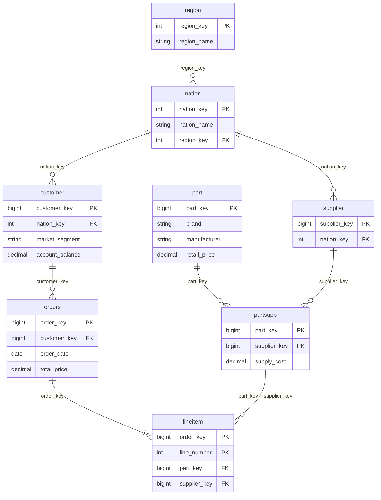

# TPC-H Lakehouse: Marketing

Group Assignment 1. We migrate the TPC-H wholesale-supplier data (`samples.tpch`) into a
bronze / silver / gold Lakehouse on Databricks, build the pipeline that populates the layers, and answer
the questions of the **Marketing** team (customer acquisition and retention).

- Presentation: `https://www.canva.com/design/DAHXUZlEnk4/0hiDveUR5vmr_z5cwYpcgQ/edit?ui=eyJBIjp7fX0`
- Dashboard: `<PASTE LINK or add a screenshot to docs/>`
- Team: see [Team and responsibilities](#team-and-responsibilities)

## Table of contents

1. [Architecture](#architecture)
2. [Repository layout](#repository-layout)
3. [Getting started](#getting-started)
4. [Bronze layer](#bronze-layer)
5. [Silver layer](#silver-layer)
6. [Gold layer](#gold-layer)
7. [Metric definitions](#metric-definitions)
8. [Validation](#validation)
9. [Monitoring and alerting](#monitoring-and-alerting)
10. [Business questions and answers](#business-questions-and-answers)
11. [Dashboard](#dashboard)
12. [Portability](#portability)
13. [Assumptions and limitations](#assumptions-and-limitations)
14. [Challenges](#challenges)
15. [Coverage of the assignment requirements](#coverage-of-the-assignment-requirements)
16. [Team and responsibilities](#team-and-responsibilities)

---

## Architecture

```
samples.tpch --> bronze (as is) --> silver (3NF + data quality) --> gold (marketing marts)
                                          |
                                          +--> ops.quarantine_<table>   (rows that failed a rule)

            ops.validation_results  <--  04_validation
            ops.kpi_snapshots       <--  06_monitoring
```

| Schema | Content |
|---|---|
| `<catalog>.<env>_tpch_mkt_bronze` | 8 tables, exact copy of the source plus `_source_table`, `_ingested_at`, `_batch_id` |
| `<catalog>.<env>_tpch_mkt_silver` | 8 tables in 3NF, readable column names, explicit types, PK/FK, NOT NULL and CHECK constraints |
| `<catalog>.<env>_tpch_mkt_gold` | `customer_activity`, `segment_summary`, `segment_kpi_monthly`, `cohort_retention_3m`, `activity_retention_3m` |
| `<catalog>.<env>_tpch_mkt_ops` | `quarantine_<table>` (8 tables), `validation_results`, `kpi_snapshots` |

Defaults: `catalog = workspace`, `env = dev`, so the default silver schema is `workspace.dev_tpch_mkt_silver`.

## Repository layout

```
notebooks/
  00_config.py              parameters (widgets), schema names; included with %run by every notebook
  01_bronze.py              source -> bronze, row-count reconciliation
  02_silver.py              bronze -> silver: types, names, keys, data-quality rules, quarantine
  03_gold.py                silver -> gold marketing tables
  04_validation.py          validation rules across all layers (fails the job on error)
  05_business_questions.py  answers to Q1-Q4 with visualisations
  06_monitoring.py          KPI trends, snapshots, alert rules and alert demo
src/tpch_marketing/config.py  single source of truth: names, allowed values, ranges, thresholds
sql/dashboard_queries.sql     queries for the Databricks AI/BI dashboard
sql/alerts/                   Databricks SQL Alerts (A1, A2)
databricks.yml                Asset Bundle: one Job running the pipeline
tests/test_config.py          unit tests for the config module
docs/presentation_outline.md  slide plan
pyproject.toml, uv.lock       uv project (dev tools: pytest, ruff, databricks-sdk)
```

## Getting started

### Prerequisites

* A Databricks workspace with **Unity Catalog** (needed for PK/FK constraints). Databricks Free Edition works.
* Read access to `samples.tpch` (available in every workspace) and permission to create schemas in the
  target catalog.
* For Option B and local checks: the Databricks CLI and [uv](https://docs.astral.sh/uv/).

### Parameters

All environment-specific values are widgets (notebooks) or job parameters (Job).

| Parameter | Default | Meaning |
|---|---|---|
| `catalog` | `workspace` | Unity Catalog catalog the team can write to |
| `env` | `dev` | Environment prefix used in every schema name (`dev`, `preprod`, ...) |
| `source` | `samples.tpch` | Schema that holds the raw TPC-H tables |

Values are validated (letters, digits and `_` only), so a malformed parameter cannot inject SQL.

### Option A: notebooks

1. In Databricks: Workspace > Create > Git folder, and paste the URL of this repository.
2. Open `notebooks/` and run in order: `01_bronze`, `02_silver`, `03_gold`, `04_validation`,
   `05_business_questions`, `06_monitoring`. Each notebook runs `00_config` itself and creates the schemas
   if they do not exist.
3. If your catalog is not `workspace`, change the `catalog` widget at the top of each notebook.

### Option B: Job via Asset Bundle

```bash
databricks auth login --host https://<your-workspace>
databricks bundle validate
databricks bundle deploy -t dev --var="catalog=<your_catalog>"
databricks bundle run tpch_marketing_pipeline -t dev
```

The Job `tpch_marketing_pipeline_<env>` runs five tasks in a chain:
`bronze -> silver -> gold -> validation -> monitoring`. A failed validation stops the chain before
monitoring. Notebook `05_business_questions` is not part of the Job; run it manually or build the
dashboard from `sql/dashboard_queries.sql`. Targets: `dev` (development mode, `env=dev`) and `preprod`
(`env=preprod`).

### Local checks (uv)

```bash
uv sync
uv run pytest
uv run ruff check .
```

The unit tests cover the config module (schema naming, input validation, SQL-list escaping, table order).
The Spark logic itself is verified by the validation notebook on real data.

### Recommended first run

Run the pipeline twice. Alert A1 compares the two latest runs in `ops.kpi_snapshots`, so it needs at
least two snapshots. The notebook also contains a demo that fires A1 on artificially degraded data, which
works after a single run.

---

## Bronze layer

Notebook: `01_bronze.py`.

* Stores all 8 TPC-H tables **as is**: same columns, types and values, no filtering or cleaning.
* Only three technical columns are added: `_source_table` (fully qualified source), `_ingested_at`
  (timestamp), `_batch_id` (one UUID per run).
* The source is a static snapshot, so every run is an idempotent full refresh (`overwrite`).
* The notebook asserts that the row count of every bronze table equals the source (rule L1).

## Silver layer

Notebook: `02_silver.py`.

### Model (3NF)

TPC-H is already close to 3NF: geography is split into `nation` and `region`, `partsupp` resolves the
many-to-many relation between `part` and `supplier`, and `orders` and `lineitem` are separate entities.
We kept the structure, gave columns readable names (`c_custkey` -> `customer_key`, `l_extendedprice` ->
`extended_price`, ...), cast every column to an explicit type, and declared primary and foreign keys.



The diagram shows keys and the main attributes only. The full column lists are in the `ddl` of each table
in `02_silver.py`.

Screenshot for the presentation: Catalog Explorer > silver schema > any table > "View relationships"
draws the ER diagram from the declared constraints. Save it as `docs/silver_er.png`.

Design notes on 3NF: `orders.total_price` is derived from the line items in the source data model, and
`part.brand` implies `part.manufacturer` (`Brand#MN` belongs to `Manufacturer#M`). We kept both because
they are part of the source contract and are needed for reconciliation and brand analysis; the first is
reconciled against line items by the Finance profile, not by Marketing.

### How data quality is enforced

Data quality is enforced on three levels:

1. **Row-level rules** (per table, in `02_silver.py`). Every row is checked against all rules of its
   table. A rule passes only if it evaluates to TRUE; NULL counts as a failure. Rows that fail at least one
   rule are written to `ops.quarantine_<table>` together with the array `_failed_rules` and a
   `_quarantined_at` timestamp. Nothing is dropped silently, and `silver + quarantine = bronze` is validated
   for every table. If a primary key is duplicated, all copies are quarantined, because we do not guess
   which copy is correct.
2. **Delta constraints.** `NOT NULL` and `CHECK` constraints are enforced by Delta on every write, so even
   a bug in step 1 cannot put a bad row into silver.
3. **Keys.** `PRIMARY KEY` and `FOREIGN KEY` constraints are declared in Unity Catalog. They are
   informational (Delta does not enforce them), so uniqueness and referential integrity are enforced by the
   rules `pk_unique` and `fk_*` in step 1 and re-checked in `04_validation.py`.

Silver tables are rebuilt on every run: dropped children first (because of foreign keys), created parents
first. The load order is `region, nation, customer, supplier, part, partsupp, orders, lineitem`.

### Rules per table

Every primary-key column is also checked for NOT NULL, and every table has `pk_unique`.

| Table | Rules |
|---|---|
| `region` | name not empty |
| `nation` | name not empty; `fk_region` |
| `customer` | name not null; `segment_valid`; `fk_nation` |
| `supplier` | name not null; `fk_nation` |
| `part` | brand not empty; manufacturer not empty; retail price > 0 |
| `partsupp` | supply cost > 0; available quantity >= 0; `fk_part`; `fk_supplier` |
| `orders` | `fk_customer`; order date not null; total price > 0; status in allowed list; priority in allowed list |
| `lineitem` | `fk_order`; `fk_partsupp` (two-column key); quantity > 0; extended price > 0; discount in range; tax in range; ship mode, return flag, line status in allowed lists; ship date >= order date; receipt date >= ship date |

### Two-column foreign key

A line item references a part-supplier pair, not a part or a supplier alone. In silver this is enforced
by a LEFT JOIN of bronze `lineitem` to `silver.partsupp` on **both** `part_key` and `supplier_key`; rows
without a match fail `fk_partsupp` and go to quarantine. The relationship is also declared as a composite
`FOREIGN KEY (part_key, supplier_key) REFERENCES partsupp`.

### Allowed values and ranges (from profiling)

Allowed lists are defined in `src/tpch_marketing/config.py`. We built them by profiling bronze
(`SELECT DISTINCT ... COUNT(*)`, `MIN`, `MAX`; the profiling cells are in `04_validation.py`) and compared
the result with the TPC-H specification.

| Field | Allowed values |
|---|---|
| `market_segment` | AUTOMOBILE, BUILDING, FURNITURE, HOUSEHOLD, MACHINERY |
| `order_status` | F, O, P |
| `order_priority` | 1-URGENT, 2-HIGH, 3-MEDIUM, 4-NOT SPECIFIED, 5-LOW |
| `ship_mode` | AIR, FOB, MAIL, RAIL, REG AIR, SHIP, TRUCK |
| `return_flag` | A, N, R |
| `line_status` | F, O |
| `discount` | 0.00 to 0.10 |
| `tax` | 0.00 to 0.08 |

## Gold layer

Notebook: `03_gold.py`. Gold is designed to answer the Marketing questions.

| Table | Grain | Used for |
|---|---|---|
| `customer_activity` | one row per customer, **including customers with zero orders** | base table for everything else |
| `segment_summary` | one row per market segment | Q1 (activation), Q3 (repeat rate) |
| `segment_kpi_monthly` | month x segment, months with 0 new customers are kept | Q2 (new customers), monitoring |
| `cohort_retention_3m` | one row per first-order month (cohort) | Q4 |
| `activity_retention_3m` | one row per activity month | Q4, alternative reading |

`customer_activity` is built from `silver.customer` with a LEFT JOIN to the order aggregates. Customers
without orders therefore stay in gold with `order_count = 0` and `is_activated = false` instead of being
dropped by an inner join. Main columns: `customer_key`, `market_segment`, `nation_name`, `region_name`,
`order_count`, `lifetime_order_value`, `first_order_date`, `second_order_date`, `last_order_date`,
`cohort_month`, `cohort_quarter`, `is_activated`, `is_repeat_buyer`, `reordered_within_3m`,
`has_full_3m_window`.

The retention window (3 months) is the parameter `RETENTION_WINDOW_MONTHS` in `config.py`; table and
column names follow it.

## Metric definitions

Every query in the solution uses these definitions.

| Metric | Definition |
|---|---|
| Customer | a row in `silver.customer` (TPC-H has no signup date, so the base is all customers) |
| Activated customer | customer with at least 1 order |
| Activation rate | activated customers / all customers (per segment) |
| Repeat customer | customer with more than 1 order |
| Repeat purchase rate | repeat customers / all customers of the segment, as in the brief; also reported among activated customers |
| New customer in period P | customer whose **first** order date falls in P |
| Cohort | calendar month of the customer's first order |
| 3-month retention | second order date <= first order date + 3 months (`ADD_MONTHS`) |
| Complete window | a cohort whose window ends after the last order date in the data (1998-08-02) is flagged `window_complete = false`; such cohorts are shown but not treated as churn |
| Activation rate to date | cumulative activated customers up to month M / all customers |
| Quarter label | `<year>-Q<n>`, e.g. `1996-Q1` |

## Validation

Notebook: `04_validation.py`. Rules use all layers (source, bronze, silver, quarantine, gold). Every run
appends its results to `ops.validation_results` (`rule_id`, `layer`, `description`, `actual`, `expected`,
`passed`, `run_ts`), and the notebook raises an error if any rule fails, so the Job turns red and the
monitoring task does not run.

| Id | Rule | Layers |
|---|---|---|
| L1 | bronze row count = source row count (every table) | source, bronze |
| L2 | silver + quarantine = bronze (every table) | bronze, silver |
| M1 | every customer has a valid, non-null market segment; bad rows found in bronze are all in quarantine | bronze, silver, gold |
| M2 | every order references an existing customer; orphan orders found in bronze are in quarantine | bronze, silver |
| M3 | customers with zero orders exist in the source, survive into silver, and appear in gold with `order_count = 0`; gold row count = silver customers; segment totals add up | bronze, silver, gold |
| G1 | `customer_key` is unique in `customer_activity` | gold |
| G2 | sum of `order_count` in gold = number of silver orders | silver, gold |
| G3 | sum of monthly new customers = number of activated customers | gold |
| G4 | activation rate is within [0, 1] | gold |

How the Marketing validation rules from the brief map to the rules above:

* Every customer has a valid, non-null segment: M1 plus the `segment_valid` row rule and the CHECK
  constraint `customer_segment_valid` in silver.
* Every order has a valid customer reference: M2 plus the `fk_customer` row rule in silver.
* Customers with no orders survive into silver and appear in gold as zero-activity: M3.

### Demo for the presentation

Run `04_validation` (all rules green), then show the latest rows of `ops.validation_results`. To show
that the rules really catch problems, insert a bad row into a copy of bronze and re-run silver: the row
lands in `ops.quarantine_<table>` with the failed rule name.

## Monitoring and alerting

Notebook: `06_monitoring.py`; SQL versions in `sql/alerts/`.

There are two notions of "over time":

* **Business time:** how KPIs evolve month by month inside the data (`gold.segment_kpi_monthly`):
  cumulative activation rate by segment and new customers per month and quarter.
* **Run time:** every pipeline run appends a KPI snapshot (`market_segment`, `customers`,
  `activated_customers`, `activation_rate`, `repeat_rate`, `run_ts`) to `ops.kpi_snapshots`. If a later
  load breaks something, the next run sees the change.

| Alert | Rule | Reasoning |
|---|---|---|
| A1 | the activation rate of any segment drops by more than 2 percentage points compared with the previous run | activation is cumulative and should never decrease; a drop of this size means lost orders or customers, not noise |
| A2 | new customers in a quarter drop by more than 30% compared with the previous quarter, only if the previous quarter had at least 100 new customers | the volume guard avoids alerts on tiny numbers, because new customers naturally fade to almost zero in the late years of TPC-H |

Thresholds are constants in `config.py` (`ALERT_ACTIVATION_DROP_PP`, `ALERT_NEW_CUSTOMERS_DROP`,
`ALERT_NEW_CUSTOMERS_MIN_BASE`).

* **A1 demo:** the notebook simulates data loss (30% of activated BUILDING customers lose their orders,
  selected by a deterministic hash) and shows that A1 fires for BUILDING only.
* **A2:** the notebook lists all quarters with the computed drop and the alert flag for inspection. The
  SQL alert `sql/alerts/a2_new_customers_drop.sql` evaluates only complete quarters and returns the latest
  one, because the last quarter of the data is partial. On this dataset the history decays to near zero by
  design, so A2 is expected to stay quiet on the real data.
* To schedule an alert, create a Databricks SQL Alert from the file in `sql/alerts/` and trigger it when
  the `alert` column is `true`.

## Business questions and answers

All answers are computed from the gold layer in `05_business_questions.py`. Fill in the table after
running the notebook.

| # | Question | Answer |
|---|---|---|
| Q1 | Activation rate for the BUILDING segment | `__ %` |
| Q2 | New customers (by first order date) in 1996-Q1 | `__` |
| Q3 | Segment with the highest repeat purchase rate | `__` (`__ %`) |
| Q4 | Share of customers in each 1996 cohort who ordered again within 3 months | `__` |

| # | Source table | Query logic | Suggested chart |
|---|---|---|---|
| Q1 | `gold.segment_summary` | `activation_rate` for `market_segment = 'BUILDING'`, shown next to the other segments | bar by segment |
| Q2 | `gold.segment_kpi_monthly` | sum of `new_customers` where `quarter = '1996-Q1'`; the full quarterly history is shown to explain the value | line by quarter |
| Q3 | `gold.segment_summary` | segments ranked by `repeat_rate`; `repeat_rate_among_active` is shown as a second view | bar by segment |
| Q4 | `gold.cohort_retention_3m` | 1996 cohorts with `cohort_size`, `reordered_customers`, `retention_rate_3m`, `window_complete`; plus `gold.activity_retention_3m` as an alternative | bar by cohort month |

Notes for interpreting the answers:

* In TPC-H, orders are spread evenly over 1992-1998 and customers place many of them, so almost every
  customer has a first order in 1992-1993. New customers in 1996-Q1 and 1996 first-order cohorts are
  therefore expected to be zero or close to zero. This is a property of the data, not a pipeline error. The
  notebook shows all cohorts to make this visible, and `activity_retention_3m` still answers the underlying
  business question ("do customers who bought in 1996 come back?").
* About a third of customers never order (by design of the generator), so activation and repeat rates
  computed over all customers are far from 100%, and differences between segments are small. We report the
  repeat rate among activated customers as well, so the comparison is not dominated by the denominator.

## Dashboard

`sql/dashboard_queries.sql` contains one query per widget for a Databricks AI/BI dashboard
"Marketing - TPC-H":

| Widget | Type | Question or purpose |
|---|---|---|
| BUILDING activation rate | counter | Q1 |
| Activation and repeat rate by segment | bar | Q1, Q3 |
| New customers in 1996-Q1 | counter | Q2 |
| New customers per quarter by segment | stacked bar | Q2, monitoring |
| Activation rate over time by segment | line | monitoring |
| Cohort 3-month retention | bar | Q4 |
| Data-quality status of the last run | table | validation |

The queries use the default prefix `workspace.dev_`. Replace it with your `<catalog>.<env>_` before
creating the dashboard in another workspace or environment.

## Portability

* No hard-coded workspace names: `catalog`, `env` and `source` are widgets and job parameters. Moving to
  another workspace means changing parameters, not code.
* We assume the team only has access to **pre-production data**, so `env` is part of every schema name and
  nothing is written outside `<catalog>.<env>_tpch_mkt_*`. The source is only read.
* All names, allowed values and thresholds live in one module,
  [`src/tpch_marketing/config.py`](src/tpch_marketing/config.py).
* Notebooks locate the module relative to their own folder, so the same code runs from a Git folder and
  from a bundle deployment.
* The Job declares no cluster and relies on serverless compute.
* Exception: the SQL files in `sql/` contain the default schema prefix and must be edited by hand (see
  [Dashboard](#dashboard)).

## Assumptions and limitations

* TPC-H has no signup date, so the customer base is fixed (all rows of `silver.customer`) and activation
  over time is the cumulative share of customers whose first order is in or before a given month.
* "Today" for the business questions is the end of the data (1998-08-02), not the current date.
* The source is static, so bronze and silver are full refreshes rather than incremental loads.
* PK and FK constraints in Delta are not enforced; enforcement is done by our own rules and re-checked by
  validation.
* Validation covers the Marketing profile. Rules specific to other profiles (for example order totals vs
  line items, or date consistency per ship mode) are only partly covered by the generic silver rules.
* `lineitem` is the largest table (tens of millions of rows); the silver step can take several minutes on
  small compute.

## Challenges

* **Customers without orders.** About a third of TPC-H customers never order. An inner join would silently
  drop them and push the activation rate towards 100%, hence the LEFT JOIN from `customer` and validation
  rule M3.
* **Late cohorts are almost empty.** See the notes above. We show the whole history and add an alternative
  view instead of reporting a bare zero.
* **Censoring.** Retention windows that run past the end of the data are flagged with `window_complete`
  instead of being counted as churn.
* **Informational keys.** Delta does not enforce PK/FK, so we built quarantine rules and validation to
  replace enforcement, including the two-column key `lineitem -> partsupp`.
* **No signup date.** Activation over time uses a fixed customer base, documented as an assumption.
* **Choosing alert thresholds.** New customers fall to almost zero by design in TPC-H, so a naive
  period-over-period alert would fire constantly; the minimum-base guard and the complete-quarter rule
  address this.

## Coverage of the assignment requirements

| Requirement | Where |
|---|---|
| Bronze: data as is, metadata only if needed | `01_bronze.py`, three technical columns only |
| Silver: 3NF with enforced data quality | `02_silver.py`: row rules, quarantine, NOT NULL and CHECK, PK/FK |
| Gold: designed for the chosen profile's questions | `03_gold.py`, five Marketing tables |
| Public repository, uv, code, README | `pyproject.toml`, `uv.lock`, this file |
| Presentation or link in README | `docs/presentation_outline.md`; link at the top of this file |
| Portable scripts, pre-production assumption | parameters `catalog`, `env`, `source`; [Portability](#portability) |
| Databricks notebooks and Jobs | `notebooks/`, `databricks.yml` |
| Team responsibilities | [Team and responsibilities](#team-and-responsibilities) |
| ER diagram of silver tables | diagram above and the Catalog Explorer screenshot |
| Answers with code and visualisation | `05_business_questions.py`, `sql/dashboard_queries.sql` |
| Validation rules (segment, order-customer reference, zero-order customers) | `04_validation.py`, rules M1-M3 |
| Monitoring and optional alerting | `06_monitoring.py`, `sql/alerts/` |
| Demo including how validation was decided | validation notebook, profiling cells, alert demo |

## Team and responsibilities

| Member | Responsibility |
|---|---|
| Daryna Nychyporuk | Bronze and silver layers, data-quality rules; ER diagram |
| Tetiana Moroz | Gold layer, business questions, dashboard |
| Anastasiia Yablunovska | Validation rules, monitoring, alerts |
| Anastasiia Liubenchuk | Repository, uv and Asset Bundle, README, presentation |
